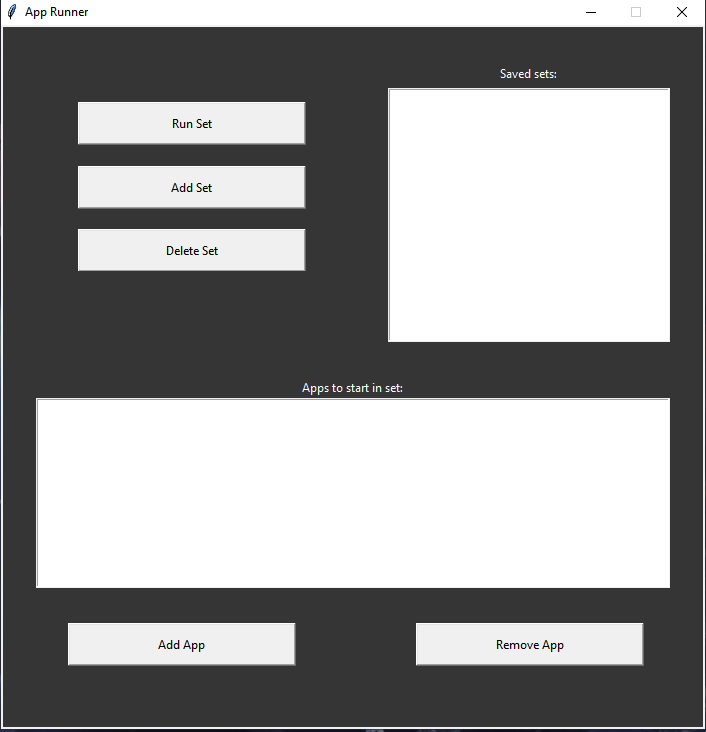

# App runner
 Program that opens a set of application
 
## Table of contents
* [Functions](#functions)
* [Setup](#setup)
* [Instruction](#instruction)
* [Technologies](#technologies)
* [To change in future](#to-change-in-future)

## Functions
 - Starting programs that are saved in a set
 - Creating new sets of applications
 - Deleting sets
 - Modifing sets
 
## Setup
 - Download a release and place it into a folder that you want it to be stored in. In that folder program will create another folder that contains all your sets of appication
 
## Instruction
 - First you have to create a new set of applications. Then add some programs that you often use at the same time. Once you're done you can run all of those programs with one click.

 
## Technologies:
 - Python 3
 - Tkinter
 
## To change in future:
 - GUI redesign
 - Printing programs names instead of their path 
